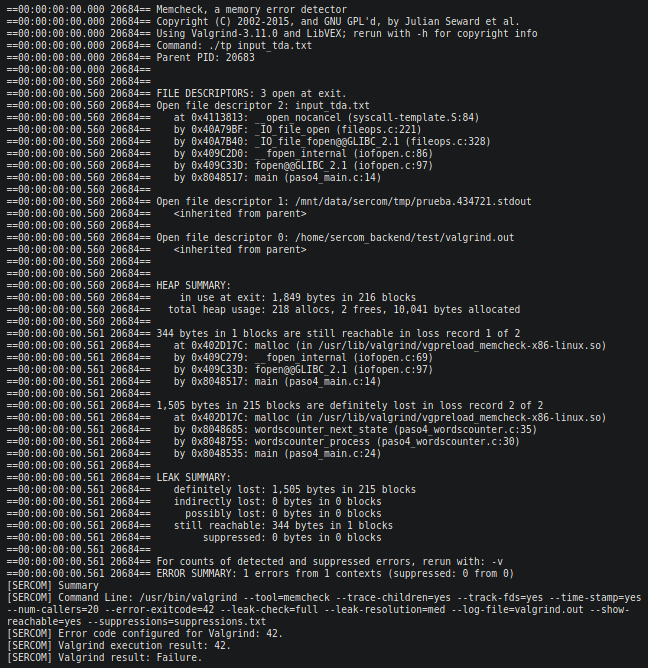
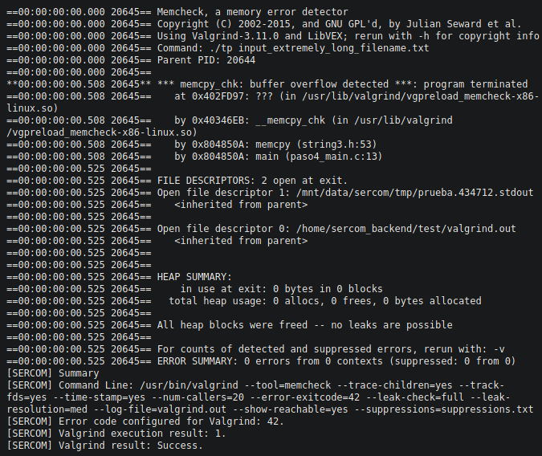
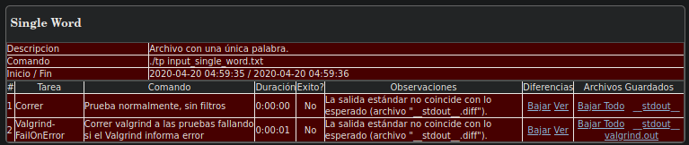

# Informe TP0

---

**Alumno:** Julián Crespo

**Padrón:** 100490

**Repositorio:** https://github.com/komod0/tp0

---

## <u>Paso 0</u>

##### a)


---

##### b)

Valgrind es una herramienta que sirve para debuggear y perfilar ejecutables, mas que nada se usa para analizar el uso de memoria de una aplicación y para detectar errores relacionados con el uso de memoria(leaks, uso de memoria sin inicializar o ya liberada, etc).

Las opciones mas comunes(al menos desde mi experiencia) son:

- `--tool=` :
  
  Especifica cual de las herramientas de valgrind se desea utilizar de las disponibles(memcheck, cachegrind, callgrind, etc), la mas usada generalmente es  memcheck que analiza problemas relacionados con la memoria.

- `--leak-check=` :
  
  Determina si se deben analizar perdidas de memoria, muestra cuanta memoria no se libero y en donde se pidió la memoria en cuestión.

- `--show-reachable=` :
  
  Determina si se debe mostrar o no los bloques de memoria que son _alcanzables_ es decir aquellos bloques de memoria que podrían haber sido liberados pero no lo fueron.

- `--track-origins=` :
  
  Si esta activada muestra de donde provienen o donde fueron creados los valores sin inicializar usados en el programa.

- `--num-callers=` :
  
  Especifica el numero de llamadas a mostrar cuando se esta analizando el origen de un cierto valor, ya sea porque se esta usando un valor sin inicializar o porque no se libero o por otro motivo, puede afectar cuando tenemos llamados a funciones muy anidados y la opción tiene un valor bajo.

---

##### c)

`sizeof()` determina el tamaño en bytes de una variable.

En el caso de `sizeof(char)` la salida va a ser igual a 1 independientemente del compilador, en el caso de `sizeof(int)` depende de la arquitectura de la computadora y de el compilador, incluso de la versión del compilador, por lo general tiene un tamaño de 2 o 4 bytes.

---

##### d)

El tamaño de un struct no necesariamente es igual a la suma de sus miembros, esto es debido al padding que agrega el compilador a cierto tipos de variables, esto es ya que es mas rápido acceder a posiciones de memoria múltiplos de cuatro, entonces en ciertos casos el compilador agrega padding para _alinear variables_.

Un ejemplo para probar que no siempre es valido esto es el siguiente:

```c
struct coso {
    int entero;
    char caract;
    float flota;
};
```

En este caso el tamaño del struct no necesariamente va a ser igual a la suma de los miembros, es probable que el compilador agregue padding a la variable `caract` para completar los 4 bytes. Corriendo una prueba localmente se obtiene que `sizeof()` del struct en cuestión devuelve 12 por lo que se observa que en este caso no se cumple.

---

##### e)

STDIN, STDOUT Y STDERR son archivos que se usan para manejar y redireccionar el flujo de entrada-salida de un programa, cada uno sirve para un proposito diferente.

STDIN representa la entrada del programa, es decir de donde el archivo lee para obtener los datos que necesita, en el ejemplo del contador de palabras se usaria el STDIN para ingresar el texto al que se le desea contar las palabras. Para usar un cierto archivo como entrada de un programa se usa el simbolo "<" o "0<" de la siguiente forma:

`programa < mientrada`

o lo que es equivalente:

`programa 0< mientrada`

STDOUT es a donde va cualquier salida de un programa que no sea un mensaje de error, para redireccionar la salida se usa el símbolo > o 1>, en el ejemplo del contador de palabras si quisiéramos guardar la cantidad de palabras de un texto en un archivo llamado "salida" se haría de la siguiente forma:

`contador < archivo > salida`

o equivalentemente:

`contaor 0< archivo 1> salida`

STDERR se usa para redireccionar los mensajes de error que ocurren durante la ejecución del programa, para ello se usa el símbolo 2> de la siguiente forma:

`programa 2> log_errores`

El símbolo | (pipe) se usa para encadenar la salida de un proceso con la entrada de otro, se usa de la manera:

`a | b`

El comando se ejecuta y se interpreta de izquierda a derecha, se ejecuta `a` y su salida sera usada como entrada de `b`

---

## <u>Paso 1</u>

##### a)


###### Archivo paso1_wordscounter.h:

- ***Lines should be <= 80 characters long  [whitespace/line_length]***: El error significa que hay una linea en el archivo que supera los 80 caracteres de largo.

###### Archivo paso1_wordscounter.c:

- ***Missing space before ( in while(  [whitespace/parens]***: No se agrego un espacio entre la condición del while y el keyword "while" es decir en vez de poner `while (condicion)` se uso `while(condicion)`

- ***Mismatching spaces inside () in if  [whitespace/parens]***: Se usaron una cantidad de espacios diferente entre el primer paréntesis del if y la condición y entre la condición y la condición y el paréntesis de cierre, es decir `if ( condicion)` en vez de `if (condicion)` o `if ( condicion )`

- ***Should have zero or one spaces inside ( and ) in if  [whitespace/parens]***: Se usaron dos espacios entre los paréntesis y la condición cuando se debería usar uno o cero.

- ***An else should appear on the same line as the preceding }  [whitespace/newline]***: El else debería aparecer en la misma linea que la llave de cerrado de la condición del if correspondiente.

- ***Missing space before ( in if(  [whitespace/parens]***: Lo mismo que el segundo error pero para un if.

- ***Extra space before last semicolon. If this should be an empty statement, use {} instead.  [whitespace/semicolon]***: Significa que hay un espacio entre la sentencia y el punto y coma que le corresponde, es decir `return algo ;` cuando debería ser `return algo;`

###### Archivo paso1_main_.c:

- ***Almost always, snprintf is better than strcpy  [runtime/printf]***: Se refiere a que el uso de snprintf es mejor o mas seguro en la mayoría de los casos ya que strcpy por ejemplo no tiene forma de saber el tamaño del buffer y esto puede causar problemas de corrupción de memoria por pasarse del tamaño máximo del buffer.

- ***An else should appear on the same line as the preceding }***: Ya explicado

- ***If an else has a brace on one side, it should have it on both  [readability/braces]***: Quiere decir que un else debería tener una cierta simetría con respecto a las llaves, es decir que si se tiene la llave de cierre del if correspondiente en la misma linea que el else, entonces la llave de apertura del else debería también estar en la misma linea que el else, análogamente si la llave de cierre del if correspondiente no esta en la misma linea que el else, entonces la llave de apertura del else tampoco debería estar en esa linea, el problema con esto ultimo es que entraría en conflicto con el error anterior de que el else este en la misma linea que el "}" predecesor.

---

##### b)


Todos los errores que se observan son de funciones sin declarar, es decir que el compilador no pudo encontrar la declaración de las funciones que indica, todos los errores son debido a que no se incluyo el archivo `paso1_wordscounter.h` que es el que contiene las declaraciones de las funciones que se indican.

Son todos errores de compilación ya que el proceso de linking es posterior a la compilación y en este caso no se esta llegando a compilar el archivo `paso1_main.c`.

---

##### c)

No se reporto ningún warning, esto es debido a que a que se utiliza el flag `-Werror` que hace que el compilador trate los warnings como si fuesen errores.

---

## <u>Paso 2</u>

##### a)

###### Archivo paso2_main.c:

- Se incluyo el archivo `paso2_wordscounter.h`

- Se reemplazo la función `strcpy(...)` por `memcpy(...)`

- Se movió el else que maneja el origen del input para que quede en la misma linea que la llave de cierre del if.

###### Archivo paso2_wordscounter.c:

- Se cambió la posición del include `paso*_wordscounter.h`

- Se movió la llave de apertura de la función `wordscounter_create` para que quede en la misma linea que la firma de la función.

- Se agrego espacio entre el `while` y el paréntesis de la condición(linea 26)

- Se eliminó espacio entre el paréntesis de apertura del if y la condición(linea 40)

- Se movió el else para que quede en la misma linea que la llave de cierre del if correspondiente(linea 45).

- Se agrego espacio entre el if y el paréntesis de la condición(Linea 46)

- Se eliminó el espacio entre `next_state` el punto y coma.

###### Archivo paso2_wordscounter.h:

- Se cambió la documentación sobre el typedef `wordscounter_t`.

---

##### b)


---

##### c)


- ```c
  In file included from paso2_wordscounter.c:1:0:
  paso2_wordscounter.h:7:5: error: unknown type name 'size_t'
       size_t words;
       ^
  paso2_wordscounter.h:20:1: error: unknown type name 'size_t'
   size_t wordscounter_get_words(wordscounter_t *self);
   ^
  paso2_wordscounter.h:25:49: error: unknown type name 'FILE'
   void wordscounter_process(wordscounter_t *self, FILE *text_file);
  ```
  
  No se incluyeron las librerías en donde se define el tipo `size_t` o `FILE`

- ```c
  paso2_wordscounter.c:17:8: error: conflicting types for 'wordscounter_get_words'
   size_t wordscounter_get_words(wordscounter_t *self) {
          ^
  In file included from paso2_wordscounter.c:1:0:
  paso2_wordscounter.h:20:8: note: previous declaration of 'wordscounter_get_words' was here
   size_t wordscounter_get_words(wordscounter_t *self);
  ```
  
  El error anterior lleva a que se generen conflictos a la hora de declaración de ciertas funciones que utilizan los tipos mencionados anteriores.

- ```c
  paso2_wordscounter.c: In function 'wordscounter_next_state':
  paso2_wordscounter.c:30:25: error: implicit declaration of function 'malloc' [-Wimplicit-function-declaration]
       char* delim_words = malloc(7 * sizeof(char));
                           ^
  paso2_wordscounter.c:30:25: error: incompatible implicit declaration of built-in function 'malloc' [-Werror]
  paso2_wordscounter.c:30:25: note: include '<stdlib.h>' or provide a declaration of 'malloc'
  ```
  
  Nuevamente no se incluyo una librería donde se especifique la definición de una función, en este caso `malloc`, como sugiere el compilador se debería incluir por ejemplo `<stdlib.h>`

Se tratan todos de errores del compilador, ya que como se menciono anteriormente el linker es posterior y no se están terminando de compilar todos los archivos.

---

## <u>Paso 3</u>

##### a)

###### Archivo paso3_wordscounter.c:

- Se incluyó la librería `<stdlib.h>`

###### Archivo paso3_wordscounter.h:

- Se incluyó la librería `<string.h>` y `<stdio.h>`

##### b)


El error se genera ya que no se encontró una definición(pero si una declaración) de la función `wordscounter_destroy`, se completó la etapa de compilación pero no la de linking, por lo que es un error de linkeo, de hecho se puede ver en el error mismo `ld returned 1 exit status`, donde `ld` es el linker de GNU.

---

## <u>Paso 4</u>

##### a)

###### Archivo paso4_wordscounter.c:

- Se agregó una definición de la función `wordscounter_destroy`.

---

##### b)



- ```c
  ==00:00:00:00.560 20684== FILE DESCRIPTORS: 3 open at exit.
  ==00:00:00:00.560 20684== Open file descriptor 2: input_tda.txt
  ==00:00:00:00.560 20684==    at 0x4113813: __open_nocancel (syscall-template.S:84)
  ==00:00:00:00.560 20684==    by 0x40A79BF: _IO_file_open (fileops.c:221)
  ==00:00:00:00.560 20684==    by 0x40A7B40: _IO_file_fopen@@GLIBC_2.1 (fileops.c:328)
  ==00:00:00:00.560 20684==    by 0x409C2D0: __fopen_internal (iofopen.c:86)
  ==00:00:00:00.560 20684==    by 0x409C33D: fopen@@GLIBC_2.1 (iofopen.c:97)
  ==00:00:00:00.560 20684==    by 0x8048517: main (paso4_main.c:14)
  ==00:00:00:00.560 20684== 
  ==00:00:00:00.560 20684== Open file descriptor 1: /mnt/data/sercom/tmp/prueba.434721.stdout
  ==00:00:00:00.560 20684==    <inherited from parent>
  ==00:00:00:00.560 20684== 
  ==00:00:00:00.560 20684== Open file descriptor 0: /home/sercom_backend/test/valgrind.out
  ==00:00:00:00.560 20684==    <inherited from parent>
  ```
  
  Se abrieron archivos pero no fueron cerrados, el error da información sobre donde se abrió cada uno.

- ```c
  ==00:00:00:00.560 20684== HEAP SUMMARY:
  ==00:00:00:00.560 20684==     in use at exit: 1,849 bytes in 216 blocks
  ==00:00:00:00.560 20684==   total heap usage: 218 allocs, 2 frees, 10,041 bytes allocated
  ==00:00:00:00.560 20684== 
  ==00:00:00:00.561 20684== 344 bytes in 1 blocks are still reachable in loss record 1 of 2
  ==00:00:00:00.561 20684==    at 0x402D17C: malloc (in /usr/lib/valgrind/vgpreload_memcheck-x86-linux.so)
  ==00:00:00:00.561 20684==    by 0x409C279: __fopen_internal (iofopen.c:69)
  ==00:00:00:00.561 20684==    by 0x409C33D: fopen@@GLIBC_2.1 (iofopen.c:97)
  ==00:00:00:00.561 20684==    by 0x8048517: main (paso4_main.c:14)
  ==00:00:00:00.561 20684== 
  ==00:00:00:00.561 20684== 1,505 bytes in 215 blocks are definitely lost in loss record 2 of 2
  ==00:00:00:00.561 20684==    at 0x402D17C: malloc (in /usr/lib/valgrind/vgpreload_memcheck-x86-linux.so)
  ==00:00:00:00.561 20684==    by 0x8048685: wordscounter_next_state (paso4_wordscounter.c:35)
  ==00:00:00:00.561 20684==    by 0x8048755: wordscounter_process (paso4_wordscounter.c:30)
  ==00:00:00:00.561 20684==    by 0x8048535: main (paso4_main.c:24)
  ```
  
  Ademas hay perdida de memoria, en parte por los archivos que no se cerraron y en parte por la cadena de caracteres que contiene los caracteres delimitadores que se crea con memoria dinámica en el archivo `paso4_wordscounter.c` pero no se libera nunca.

---

##### c)



- ```c
  **00:00:00:00.508 20645** *** memcpy_chk: buffer overflow detected ***: program terminated
  ==00:00:00:00.508 20645==    at 0x402FD97: ??? (in /usr/lib/valgrind/vgpreload_memcheck-x86-linux.so)
  ==00:00:00:00.508 20645==    by 0x40346EB: __memcpy_chk (in /usr/lib/valgrind/vgpreload_memcheck-x86-linux.so)
  ==00:00:00:00.508 20645==    by 0x804850A: memcpy (string3.h:53)
  ==00:00:00:00.508 20645==    by 0x804850A: main (paso4_main.c:13)
  ==00:00:00:00.525 20645== 
  ==00:00:00:00.525 20645== FILE DESCRIPTORS: 2 open at exit.
  ==00:00:00:00.525 20645== Open file descriptor 1: /mnt/data/sercom/tmp/prueba.434712.stdout
  ==00:00:00:00.525 20645==    <inherited from parent>
  ==00:00:00:00.525 20645== 
  ==00:00:00:00.525 20645== Open file descriptor 0: /home/sercom_backend/test/valgrind.out
  ==00:00:00:00.525 20645==    <inherited from parent>
  ```
  
  Hay dos errores, uno es el mismo que en el test anterior, que no se cerraron archivos que se abrieron, el otro esta relacionado con un buffer overflow como se menciona, lo que pasa probablemente es que se uso un archivo cuyo nombre tiene una longitud mayor a 30 caracteres, que son los que se especifican en `paso4_main.c`.

---

##### d)

Si, se podría haber evitado el buffer overflow con `strncpy` ya que la función limita la cantidad de bytes que se pueden copiar en el string de destino , suponiendo que se limita la cantidad de caracteres del nombre del archivo a 30, la ejecución de la prueba habría fallado en el ejemplo anterior, ya que al usar `strncpy` se habría truncado el nombre del archivo, entonces cuando se intenta abrir fallaría.

---

##### e)

Un **segmentation fault** ocurre cuando se intenta acceder a una posición de memoria restringida/no permitida.

El **buffer overflow** sucede cuando nos excedemos de los limites de un buffer y comenzamos a escribir fuera de ellos.

---

## <u>Paso 5</u>

##### a)

###### Archivo paso5_main.c:

- Se reemplazo el uso de `memcpy` junto con la declaración de un buffer para guardar el titulo del archivo por el uso directo de `fopen` con el argumento de consola.

- Se agrego código para cerrar los archivos abiertos.

###### Archivo paso5_wordscounter.c:

- Se reemplazo el array de char creado con memoria dinámica por un arreglo `const `de chars

---

##### b)

La prueba **Invalid file** falla porque el programa no retorna el código correcto en caso de que se ingrese un archivo no valido/inexistente, en el SERCOM se puede ver que el código esperado era 1 pero se devolvió 255, en el archivo `paso5_main.c` se puede ver que se esta retornando -1 en caso de que falle la apertura del archivo, pero dado que los exit codes toman valores en el rango 0-255, el -1 se convierte en un 255.


La prueba **Single word** falla ya que como se puede ver en el SERCOM se devuelve un valor que no es el esperado, la prueba esperaba que se devuelva 1 y se devolvió 0 como la cantidad de palabras, esto es ya que la única palabra del archivo es seguida de un fin de linea, el programa aumenta en uno el contador de palabras solo cuando encuentra un delimitador a continuación de una letra, el problema es que a continuación de la palabra hay un fin de archivo y no un delimitador, por lo que la cuenta final de palabras es 0.



---

##### c)


Como se puede ver el ultimo caracter es el correspondiente al 64 en hexa, que es la letra "d".

---

##### d)


- `info functions`: Imprime la firma de todas las funciones definidas en el programa y un grupo de variables definidas implícitamente por el compilador.

- `list wordscounter_next_state`: Muestra el código de la función especificada, en este caso `wordscounter_next_state`.

- `list`: Al ser el ultimo comando ejecutado uno de tipo `list` el comando simplemente imprime mas lineas continuando desde donde quedo el anterior.

- `break 45`: Inserta un breakpoint en la linea 45 del archivo, es decir cuando se "pase" por la linea 45 la ejecución del programa se detendrá.

- `quit`: Sale de gdb.

El debugger no se detuvo en el breakpoint de la linea 45 por lo que se explicó en el item **b)**.

---

## <u>Paso 6</u>

##### a)

###### Archivo paso6_main.c:

- Se cambio el valor de retorno en caso de que falle la apertura del archivo de -1 a 1.

###### Archivo paso6_wordscounter.c:

- Se reemplazo la variable const que almacenaba los delimitadores por una macro.

- Se modificó la lógica del programa para que tenga en cuanta el caso donde hay un EOF inmediatamente después de una palabra.

---

##### b)


---

##### c)


